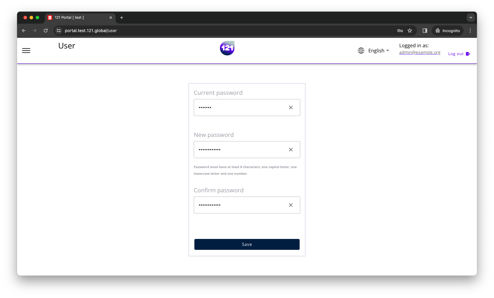

!!! Important "Who can perform actions on this page ?"
    All users can change their own passwords.

Once you are logged in to the 121 Platform, click on your email address under "Logged in as" in the top right corner.

- **Log in to the 121 Platform**,
- Click on **:material-account-outline: Account** on the top right corner and select **Change Password**,
- Enter your **current password**,
- **Enter your new password**, then **Confirm** your new password.
- Click on **Change Password** to save your new password.

---

If you lost or do not remember your password, you can contact your Organisational Admin user, so he/she will reset your password [by following the instructions on the Reset password page.](../general/reset-password.md). Once you have logged in with you new password, we kindly recommend you to change your new password for additional security.

If you are still not able to log in the 121 Platform, contact your dedicated Account Manager directly or reach out to our support team via <support@121.global>

---

-8<- "docs/_snippets/contact-support.md"
